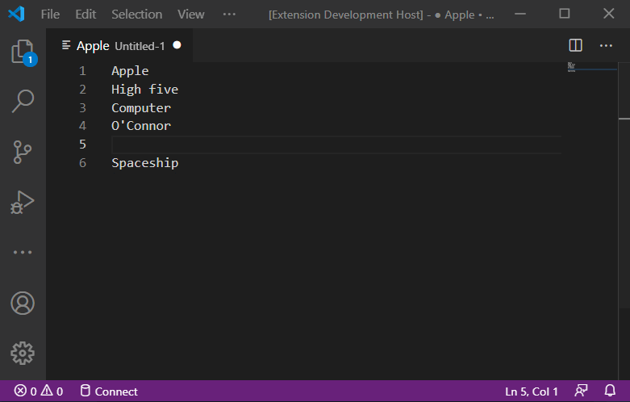

# Install today
[Find the extension here on the Visual Studio Marketplace](https://marketplace.visualstudio.com/items?itemName=reZach.listtosql).

# Features
Converts any list of values into a comma-separated SQL list (enclosed by parentheses).

# Extra features
- Select a line with no text? Do not worry, this extension excludes any empty value from the output.
- Elements with single quotes `'` will be escaped automatically.
- For selections of greater than 1000 elements/rows, the extension will automatically create groups containing 1000 elements each.
- You have an option of rendering the output in a vertical form (`List to SQL (vertical)`).
